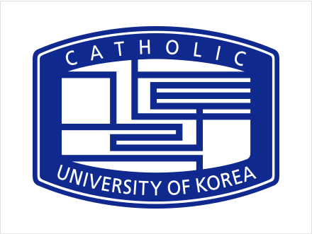
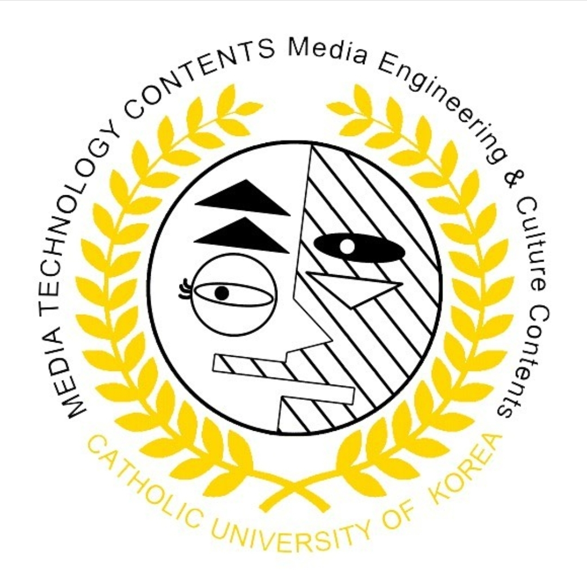

# Welcome to CVMILab-CUK git organization!

{: width="50%" height="100"}
{: width="50%" height="100"}

This organization page for Computer Vision & Machine Intelligence Lab in Catholic University of Korea. 🇰🇷

The Computer Vision and Machine Intelligence laboratory is a media engineering laboratory that studies image processing and computer vision.

The main research areas are medical image processing, smart farms, machine learning/deep learning-based image processing, and computer vision.

We are currently conducting research on the overall areas of computer vision, including Object Detection, Image Segmentation, Facial Landmark Detection, and Human Pose Estimation.
